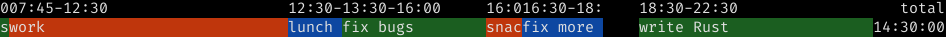

# RTW Commands

<!--ts-->
   * [RTW Commands](#rtw-commands)
      * [Start New Activity](#start-new-activity)
         * [Start tracking an activity now](#start-tracking-an-activity-now)
         * [Start tracking an activity 4 minutes ago](#start-tracking-an-activity-4-minutes-ago)
         * [Start tracking an activity at a specific time](#start-tracking-an-activity-at-a-specific-time)
      * [Stop Current Activity](#stop-current-activity)
         * [Stop current activity now](#stop-current-activity-now)
         * [Stop current activity 4 minutes ago](#stop-current-activity-4-minutes-ago)
         * [Stop current activity at a specific time](#stop-current-activity-at-a-specific-time)
      * [Cancel current activity](#cancel-current-activity)
      * [Display Summary](#display-summary)
         * [Display finished activities summary for today](#display-finished-activities-summary-for-today)
         * [Display finished activities summary for yesterday](#display-finished-activities-summary-for-yesterday)
         * [Display finished activities summary for last week](#display-finished-activities-summary-for-last-week)
         * [Display finished activities summary for range](#display-finished-activities-summary-for-range)
         * [Display finished activities id](#display-finished-activities-id)
      * [Display a timeline](#display-a-timeline)
         * [For the day](#for-the-day)
         * [For the week](#for-the-week)
         * [For a time range](#for-a-time-range)
      * [Export Finished Activities to iCalendar](#export-finished-activities-to-icalendar)
         * [For today](#for-today)
         * [For last week](#for-last-week)
         * [For a given date range](#for-a-given-date-range)
      * [Continue Activity](#continue-activity)
         * [Continue last finished activity](#continue-last-finished-activity)
      * [Delete Activity](#delete-activity)
         * [Delete Activity with id](#delete-activity-with-id)
      * [Track a finished activity](#track-a-finished-activity)
         * [Track a finished activity with dates](#track-a-finished-activity-with-dates)
         * [Track a finished activity the same day](#track-a-finished-activity-the-same-day)
      * [Track an activity and provide a long description](#track-an-activity-and-provide-a-long-description)
      * [For multitasking people](#for-multitasking-people)
         * [Start (overlapping) activities](#start-overlapping-activities)
         * [Stop ongoing activity](#stop-ongoing-activity)

<!--te-->
Created by [gh-md-toc](https://github.com/ekalinin/github-markdown-toc)

## Start New Activity

### Start tracking an activity now
 
Example:
 ```
 rtw start write doc
```

Example output:
```
Tracking write doc
Started  2019-12-25T19:43:00
```

### Start tracking an activity 4 minutes ago

Example:
```
rtw start 4 min ago write doc
```

Example output:
```
Tracking write doc
Started  2019-12-25T19:39:00
```

### Start tracking an activity at a specific time

Example:
```
rtw start 2019-12-24T19:43:00 write doc
```

Example output:
```
Tracking write doc
Started  2019-12-24T19:43:00
```

## Stop Current Activity

### Stop current activity now

Example:
```
rtw stop
```

Example output:
```
Recorded write doc
Started 2019-12-25T19:43:00
Ended   2019-12-25T19:50:00
Total   00:07:00
```

### Stop current activity 4 minutes ago

Example:
```
rtw stop 4m ago
```

Example output:
```
Recorded write doc
Started 2019-12-25T19:43:00
Ended   2019-12-25T19:46:00
Total   00:03:00
```

### Stop current activity at a specific time

Example:
```
rtw stop 2019-12-25T19:45:00
```

Example output:
```
Recorded write doc
Started 2019-12-25T19:43:00
Ended   2019-12-25T19:45:00
Total   00:02:00
```

## Cancel current activity

Example:
```
rtw cancel
```

Example output:
```
Cancelled write doc
Started   2019-12-24T19:43:00
Total     00:20:05
```

## Display Summary

### Display finished activities summary for today

Example:
```
rtw summary
```

Example output:
```
write doc    2019-12-25T19:43:00 2019-12-25T19:45:00 00:03:000
```

### Display finished activities summary for yesterday

Example:
```
rtw summary --yesterday
```

Example output:
```
write doc    2019-12-24T19:43:00 2019-12-24T19:45:00 00:03:000
```

### Display finished activities summary for last week

Example:
```
rtw summary --lastweek
```

Example output:
```
write doc    2019-12-17T19:43:00 2019-12-17T19:45:00 00:03:000
```

### Display finished activities summary for range

Example:
```
rtw summary 19:00 - 20:00
```

Example output:
```
write doc    2019-12-17T19:43:00 2019-12-17T19:45:00 00:03:000
```

### Display finished activities id

Example:
```
rtw summary --id
```

Example output:
```
 2 foo          2019-12-25T17:43:00 2019-12-25T17:44:00 00:01:00
 1 another foo  2019-12-25T18:43:00 2019-12-25T18:44:00 00:01:00
 0 bar          2019-12-25T19:43:00 2019-12-25T19:44:00 00:01:00
```

> id 0 = last finished activity

## Display a timeline

### For the day

```bash
rtw day
```

Example output (YMMV):



### For the week

```bash
rtw week
```

### For a time range

```bash
rtw timeline last monday - now
```

## Export Finished Activities to iCalendar

### For today

Example:
```
rtw dump
```

Example output:
```
BEGIN:VCALENDAR
VERSION:2.0
PRODID:ICALENDAR-RS
CALSCALE:GREGORIAN
BEGIN:VEVENT
DTSTAMP:20200616T184116Z
DTEND:20200616T203000
DTSTART:20200616T160000
SUMMARY:build a spaceship
UID:3bc8b3b6-d17b-4e1d-8323-2f55bfb14792
END:VEVENT
END:VCALENDAR
```

Dump to ics file: `rtw dump > today.ics`

### For last week

Example:
```
rtw dump lastweek
```

Dump to ics file: `rtw dump --lastweek > lastweek.ics`

### For a given date range

Example:
```
rtw dump last monday - now
```

Dump to ics file: `rtw dump last monday - now > lastweek.ics`

## Continue Activity

### Continue last finished activity

Example:
```
rtw continue
```

Example output:
```
Tracking write doc
Total    00:00:00
```

## Delete Activity

### Delete Activity with id

Example:
```
rtw delete 1
```

Example output:
```
Deleted write doc
Started 2019-12-25T19:43:00
Ended   2019-12-25T19:45:00
Total   00:02:00
```

## Track a finished activity

### Track a finished activity with dates

Example:
```
rtw track 2019-12-25T19:43:00 - 2019-12-25T19:45:00 write doc
```

> please note the `-` separator

Example output
```
Recorded write doc
Started 2019-12-25T19:43:00
Ended   2019-12-25T19:45:00
Total   00:02:00
```

### Track a finished activity the same day

Example:
```
rtw track 09:00 - 10:00 write doc
```

> please note the `-` separator

Example output
```
Recorded write doc
Started 2020-03-14T09:00:00
Ended   2020-03-14T10:00:00
Total   01:00:00
```

## Track an activity and provide a long description

Example:

```
rtw track 9 - 10 breakfast -d "I ate delicious pancakes"
rtw summary -d
```

output:
```
breakfast 2020-07-11T09:00:00 2020-07-11T10:00:00 01:00:00
I ate delicious pancakes
```

## For multitasking people

Requires `deny_overlapping: false` in `rtw_config.json`

### Start (overlapping) activities

Example:

```
rtw start work
rtw start child question -d "answer how fish can breath under water"
rtw
```

Output:

```
./target/debug/rtw                                                                                                                                       PicoJr
Tracking work
Total    00:03:03
Id       0
Tracking child question
Total    00:01:25
Id       1
```

### Stop ongoing activity

`--id` is only required when ongoing activities > 1.

Example:

```
rtw stop --id 1
```

Output:

```                                                                                                                        PicoJr
Recorded child question
Started 2020-07-14T10:54:36
Ended   2020-07-14T10:57:23
Total   00:02:47
```

stop the other remaining ongoing activity:

```
rtw stop
```

Output:

```
Recorded work
Started 2020-07-14T10:52:58
Ended   2020-07-14T11:00:17
Total   00:07:18
```
